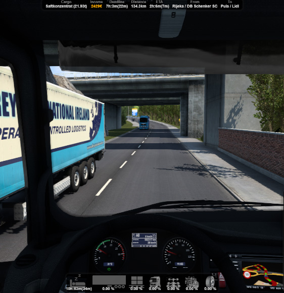

# Telemetry JSON Service for ETS2/ATS
This small application can be used to get the telemetry data from both [SCS](https://www.scssoft.com/) games ETS2 and ATS in JSON format by using this application's embedded API.
You can get the data by calling http://localhost:6969/ directly from your browser or whatever app you want to use.

The data comes more or less raw from the SCS SDK and looks like [this](https://github.com/dichternebel/scs-telemetry-json-service/blob/main/mock/data.json):
```json
{
  "CommonValues": {
    "GameTime": {
      "Value": 49496,
      "Date": "0001-02-04T08:56:00Z"
    },
    "NextRestStop": {
      "Value": 658,
      "Date": "0001-01-01T10:58:00Z"
    },
    "NextRestStopTime": {
      "Value": 50154,
      "Date": "0001-02-04T19:54:00Z"
    },
    "Scale": 3.0
  },
  "ControlValues": {
    "InputValues": {
      "Steering": -0.00303654536,
      "Throttle": 0.0,
      "Brake": 0.0,
      "Clutch": 0.0
    },
    "GameValues": {
      "Steering": -0.00303654536,
      "Throttle": 0.0,
      "Brake": 0.0,
      "Clutch": 0.0
    }
  },
  "DllVersion": 12,
  "Game": "ETS2",
  [...]
}
```

## OBS Overlays included
The main use case for creating this thing was to _save_ my [custom OBS overlays](https://github.com/dichternebel/ets2-telemetry-overlay) I created for [Funbit's Telemetry Server](https://github.com/funbit/ets2-telemetry-server/). Unfortunately, that project seems to be no longer maintained and it's not working anymore with the current ETS2 version.

That said, you might just grab this in order to get OBS overlays for ETS2 and use it for your stream:



## Intention
Use this for grabbing JSON telemetry data and for creating e.g. **HTML overlays for OBS**. Feel free to use the included overlays as a starting point or create your own fancy stuff if you are more into modern HTML than I am.

If you want to create e.g. a **dashboard for ETS2** instead of overlays it might be easier to start with [Kniffen's Node module](https://github.com/kniffen/TruckSim-Telemetry) or the [Eurotruck Simulator 2 Dashboard skin](https://github.com/JAGFx/ets2-dashboard-skin) by JAGFx. 

## Prerequisites
- [.Net 4.8](https://dotnet.microsoft.com/en-us/download/dotnet-framework/net48) (should be already there if using Win10/11)

## Setup
- Download the [SCS-SDK-plugin v.1.12.1](https://github.com/RenCloud/scs-sdk-plugin/releases/tag/V.1.12.1) and copy the `Win64\scs-telemetry.dll` into `[...]\SteamLibrary\steamapps\common\Euro Truck Simulator 2\bin\win_x64\plugins`
- Download this thing from the [Releases](https://github.com//dichternebel/scs-telemetry-json-service/releases/latest/) section and extract it to wherever you want
- Start the executable and keep it running (it's located to the system tray then)

## Limitations
- Must run on the same machine as your game

## Customization
- Change the used port and address in `TelemetryJsonService.exe.config` to match your needs

## Using it in OBS
- Add two browser sources to OBS for the job and the status telemetry overlays
- Change their width and height sizes filling your OBS resolution (not manually, go to the settings dialog of the browser source!)
- change the source to **local file** and chose `[...]\scs-telemetry-json-service\overlays\overlay-job.html` and the other to `[...]\scs-telemetry-json-service\overlays\overlay-status.html`
- both overlays are **hidden as long as your a not on a job or the game is paused**. This behavior can be changed when removing the corresponding CSS classes from the HTML tag. If you don't understand this, nevermind. It's CSS... nobody does!

## Under the hood
The application is just a wrapper using RenCloud's scs-sdk-plugin. It's taking the payload and serves it as JSON.

The overlays are plain HTML/CSS and vanilla JS using jQuery to periodically poll and display the data. That might or might not be suitable for you. It's working fine when using OBS though.

It's a plain good old Windows Forms application. If you want to build, modify and run this on your own just clone the repo, open the solution in Visual Studio and hit `F5` to get started.
